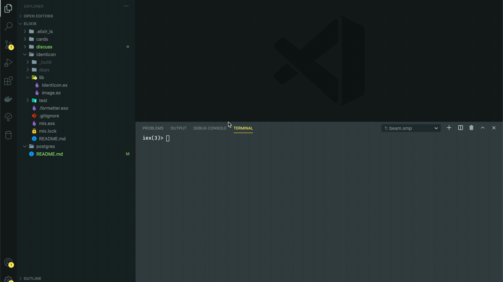

# Elixir Playground

## Description

The objective of this repository is purely to store all of the code that I've been playing around related to the the elixir language. This repository is composed by three folders: cards, identicon and discuss and here below there is a few explanation about each of this folders:

## 1 - Discuss
This is an elixir application, using the Phoenix framework and the main objective of this app is to be a forum where people can post topics to discuss, commenting on this topics. Main points of the app:

* ### Login with Github (OAuth)


* ## CRUD Topics


* ## Add comments (shown in real time, using websocket)


## 2 - Identicon

* ## Simple elixir module to generate Identicon based on strings



## 3 - Cards

* ## Just a simple module to deal shuffled cards for a given hand size

```elixir
iex(2)> Cards.create_hand(5)
{["Ace of Clubs", "Two of Diamonds", "Two of Clubs", "Five of Clubs",
  "Four of Clubs"],
 ["Three of Diamonds", "Four of Spades", "Ace of Spades", "Two of Hearts",
  "Three of Spades", "Four of Hearts", "Ace of Diamonds", "Three of Clubs",
  "Five of Spades", "Ace of Hearts", "Five of Diamonds", "Four of Diamonds",
  "Three of Hearts", "Two of Spades", "Five of Hearts"]}
```