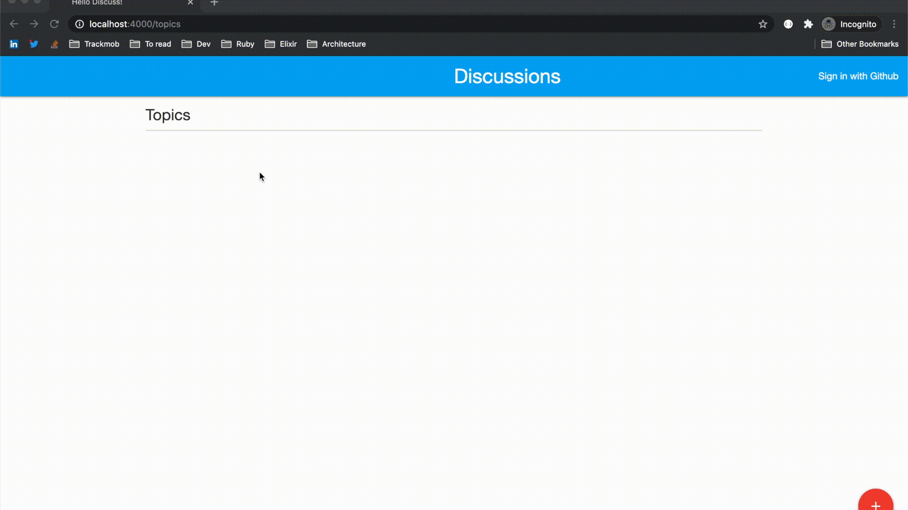

# Elixir Playground

## Genral Description

The objective of this repository is purely to store all of the code that I've been playing around related to the the elixir language. This repository is composed by three folders: cards, identicon and discuss and here below there is a few explanation about each of this folders:

## Discuss
This is an elixir application, using the Phoenix framework and the main objective of this app is to be a forum where people can post topics to discuss, commenting on this topics. Main points of the app:

* ### Login with Github (OAuth)

* ## CRUD Topics

* ## Add comments (shown in real time, using websocket)

## Identicon

* ## Simple elixir module to generate Identicon based on strings

## Cards
Nothing special
: https://github.com/gustavomrs/elixir-playground/tree/master/cards
